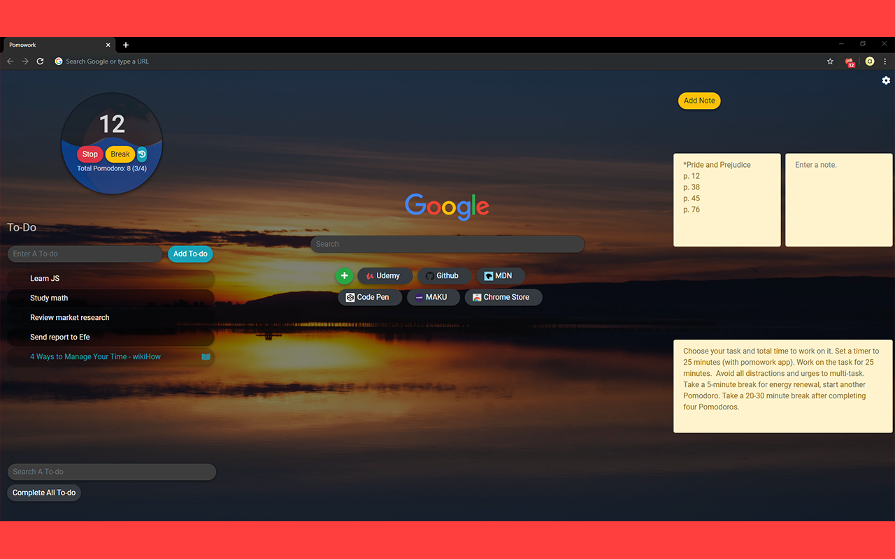
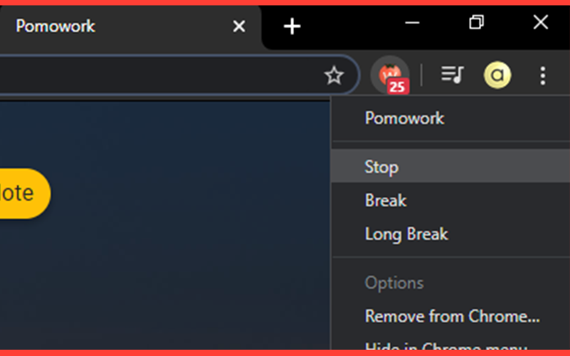
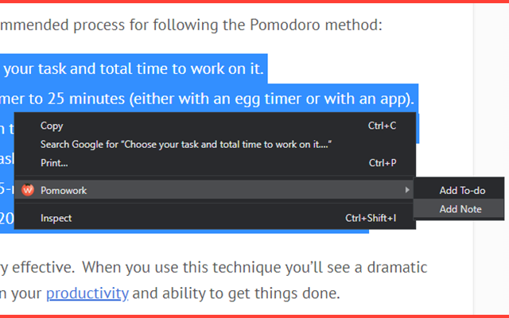

[![Contributors][contributors-shield]][contributors-url]
[![Forks][forks-shield]][forks-url]
[![Stargazers][stars-shield]][stars-url]
[![Issues][issues-shield]][issues-url]
[![MIT License][license-shield]][license-url]
[![LinkedIn][linkedin-shield]][linkedin-url]

 

  

  <h3 align="center">Pomowork</h3>

  

    Work and time management assistant.
     
     
    <a href="https://github.com/ahmet-cetinkaya/Pomowork/issues">Report Bug</a>
  

  
Table of Contents

  <ol>
    <li>
      <a href="#about-the-project">About The Project</a>
    </li>
    <li>
      <a href="#getting-started">Getting Started</a>
      <ul>
        <li><a href="#installation">Installation</a></li>
      </ul>
    </li>
    <li><a href="#license">License</a></li>
    <li><a href="#contact">Contact</a></li>
  </ol>

## About The Project

- A functional new tab for your work
- Pomodoro countdown timer in new tab and toolbar
- Track average Pomodoro time
- Configurable settings
  - Focus time
  - Break time
  - Long Break time
  - Daily Wallpaper
    - Wallpaper categories
  - Custom Wallpaper
- Supported languages: EN, TR

 

  
Screenshots

    
    
    
    

 

## Getting Started

### Installation

You can download from [Chrome Web Store](https://chrome.google.com/webstore/detail/pomowork-pomodoro%C2%AE-and-to/likibnmpifknedmpikkllcfikoknafen)

You can install it manually by selecting the source folder you downloaded by opening developer mode at `chrome://extensions/`.

## License

Distributed under the MIT License. See `LICENSE` for more information.

## Contact

Ahmet Çetinkaya - [@ahmetctnky_txt](https://twitter.com/ahmetctnky_txt) - [ahmetcetinkaya7@outlook.com](mailto:ahmetcetinkaya7@outlook.com)

[contributors-shield]: https://img.shields.io/github/contributors/ahmet-cetinkaya/Pomowork.svg?style=for-the-badge
[contributors-url]: https://github.com/ahmet-cetinkaya/Pomowork/graphs/contributors
[forks-shield]: https://img.shields.io/github/forks/ahmet-cetinkaya/Pomowork.svg?style=for-the-badge
[forks-url]: https://github.com/ahmet-cetinkaya/Pomowork/network/members
[stars-shield]: https://img.shields.io/github/stars/ahmet-cetinkaya/Pomowork.svg?style=for-the-badge
[stars-url]: https://github.com/ahmet-cetinkaya/Pomowork/stargazers
[issues-shield]: https://img.shields.io/github/issues/ahmet-cetinkaya/Pomowork.svg?style=for-the-badge
[issues-url]: https://github.com/ahmet-cetinkaya/Pomowork/issues
[license-shield]: https://img.shields.io/github/license/ahmet-cetinkaya/Pomowork.svg?style=for-the-badge
[license-url]: https://github.com/ahmet-cetinkaya/Pomowork/blob/master/LICENSE.txt
[linkedin-shield]: https://img.shields.io/badge/-LinkedIn-black.svg?style=for-the-badge&logo=linkedin&colorB=555
[linkedin-url]: https://linkedin.com/in/ahmet-cetinkaya
