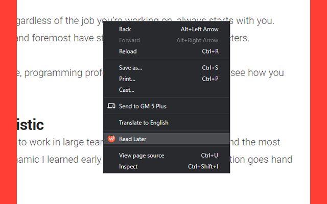

# Pomowork
Work and time management assistant.

## Features

- A functional new tab for your work
- Pomodoro countdown timer in new tab and toolbar
- Track average Pomodoro time
- Configurable settings
	- Focus time
	-  Break time
	- Long Break time
	- Daily Wallpaper
		- Wallpaper categories
	- Custom Wallpaper 
- Supported languages: EN, TR
- Open-source software: 
https://github.com/ahmet-cetinkaya/Pomowork

Chrome Web Store: (in review by Google.)

You can install it manually by selecting the source folder you downloaded by opening developer mode at "chrome://extensions/".

## Screenshots

Note: Pomodoro® and The Pomodoro Technique® are trademarks of Francesco Cirillo. Marinara is not affiliated or associated with or endorsed by Pomodoro®, The Pomodoro Technique® or Francesco Cirillo.
